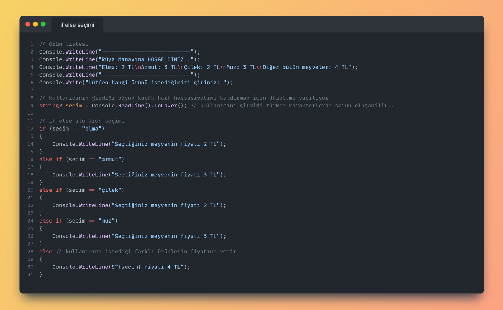
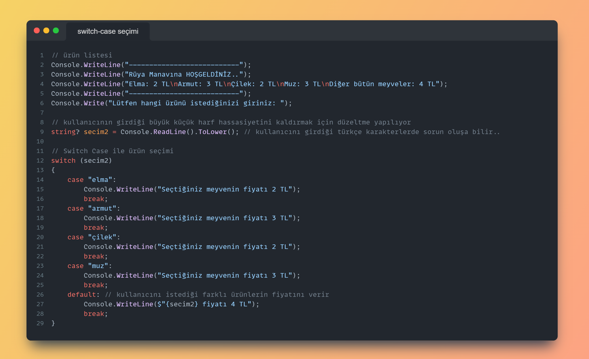
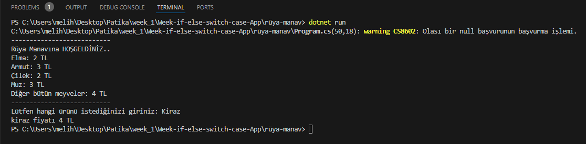

# Rüya Manav App
- if
- else 
- else if
- switch 

yapılarını kullanarak oluşturulan ödev

## Seçim:
Bu uygulamamnın Switch case ile yapılması daha uygun 
çünkü kullanıcıdan alınan değer if else yapısında tek tek dolaşacak ancak switch case 
yapısında bulunduğu satıra gidip yapıdan çıkacak yani çok veri olan durumlarda switch case yapısı kullnımı daha anlamlı olur...

## if else seçimi
- Code:

## switch case seçimi
- Code:

## Output:

